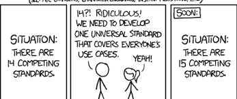

## Are coding standards even needed today?

Coding standards used to be very strict due to limitations such as memory, and only having access to punch cards or command lines. But with the vast amounts of memory available for modern day computers, coupled with the intelligent IDE's that pretty much auto format code for you, it really makes you  wonder if coding standards are still necessary. When I first started programming, I was in the camp of *loose coding standards* primarily because I just didn't understand why it was so important. My thought process generally went *I don't need to have good coding standards because I can just press format code when I'm done*. Now if you're only working with small projects that have at most maybe 50 lines, sure coding standards probably don't mean much, but once you move past that point, it becomes incredibly important.

## Impact of coding standards in collaborative work

If you've never understood the importance of coding standards, a surefire way for you to understand would be to get involved in a collaborative programming project. Coding standards allow users to understand each other's codes more easily. It might seem like a hassle having to add comments to certain methods/functions, or having to use proper spacing, or following naming conventions. But if you're working on a project with someone, these rules allow your partner to quickly understand what you're doing and vice versa. I've personally worked with individuals that never comment anything and when you run into issues, it takes so much unnecessary time to solve them because you have to manually trace every step of what they wrote just to get a slight glimpse of what might be causing the problem. 

## When coding standards were required for your code to run

When you're stuck working with in a unix environment and have to write code in ANSI C, if you don't follow rules such as initializing variables before assigning them values, or have leveled curly braces your code will not run. Navigating through your code using a shell text editor like nano or pico is extremely infuriating if you don't have braces leveled. Although these rules might seem super annoying to follow at first, if you look at why they were implemented it does make sense. For example, in the case of initializing variables before assigning values to them, it seems very redundant to do that now because many modern programming languages do both functions on the same line, it really does take 2 steps: create the variable, assign value to it. 
