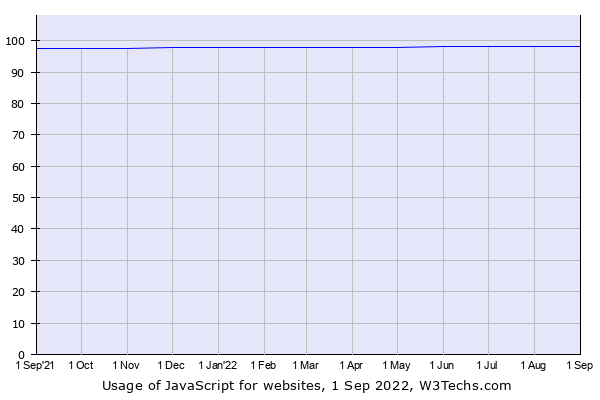

## JavaScript and high-level programming languages

Learning high-level programming languages such as JavaScript or Python are great ways to get started with programming because their syntax is much easier to write, understand, and implement. In the past only knowing these programming languages was often frowned upon because of their lack of scalability, poor memory efficiency, and lack of data structures. This is especially true in academics where many programming fundamentals are taught using lower-level programming languages such as C, C++, and Java. Although learning lower-level languages can be beneficial does it have to be this way? With how much high-level languages have evolved coupled with the ridiculous amounts of storage and speed avaialable on modern computers. Is it possible to get by with only knowing JavaScript?

##  Viability of JavaScript today

As far as web programming is concerned JavaScript might be one of the most if not the most important tool for managing webpage behavior. Infact according to a survey performed by w3tech:
>*JavaScript is used as client-side programming language by 98.0% of all the websites* https://w3techs.com/technologies/details/cp-javascript/
Outside of web programming, usage of JavaScript is still very prevalant which is due to how well it has evolved and adapted over time. On conception, JavaScript could only be used with webpages and thus was viewed as Scripting Language. But with the creation of runtime systems such as Node.js and development into a multi-paradigm programming language. JavaScript was able to go beyond webpages with integration in popular applications such as Adobe Acrobat and even embedded systems https://www.espruino.com/.  

## Applications of JavaScript in Software Engineering, Athletic SE/WODS 

Although JavaScript is not very viable for back-end development, it's incredibly important for front-end,full-stack, and devops teams. So I'd argue that because of how important it is in other facets outside of back-end development, it is vital for software engineers to learn. Use of JavaScript for Athletic SE in WODS is a great way to effectively learn and apply JavaScript. The pressure of the WODS has personally helped me tackle one of my weaknesses which is overthinking solutions to simple problems. The WODS are also very similar to blackboard interviews scenarios and coding competitions such as Google kickstart both of which now allow JavaScripthttps://codingcompetitions.withgoogle.com/kickstart/faq.  

## So should you only learn JavaScript?

Even though JavaScript can be viewed as a swiss army knife of programming languages I don't think it is viable as standalone language. Low-level languages like C might seem outdated, but because of how efficient they are for space/time they are still vital for huge projects like game development. Using Low-level languages can also help with understanding how computers facilitate memory allocation and help drill in good formatting habits.
