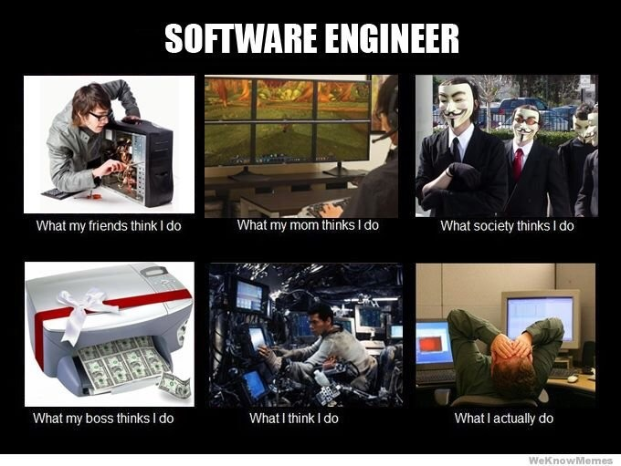

## What is Software Engineering 

In general media, Software Engineering is often times used colloquially to refer to coding in general. But the truth is that it goes beyond just coding as it is a process of designing, building, testing, and maintaining software systems apply principles and practice from computer science and engineering to the development of software products. Activities that are present in this domain include requirement gathering and analysis, design and implementation, testing and maintenance. Developing strong communication skills and being able to  adapt with changing requirements are key tenets to becoming a great software engineer.

## Why do Software Engineers need good communication skills?

Having strong communication skills is important for Software Engineers because you're almost always working with a team. If you're unable to properly communicate with your peers you can easily get overwhelmed or feel out of the loop which can lead to poor results. Through the use of different project management approaches such as agile project management, Software Engineers can develop strong channels of communication and adapt quickly to changes which in the end drastically improves productivity. Through the use of Issue Driven Project Management which is a style of Agile that focuses on working in small "sprints" to deliver small increments of functionality, I was able to constantly address issues and continually make progress when working with team of people I've never worked with before.

## How can Software Engineers adapt to changes in requirements and technology?

Although the answer to this question might seem straight forward (be open to learning everything that's new) there are tools and skills that Software Engineers can utilize that can help prepare them for changes. Understanding the strength and differences of different programming paradigms and how they are implemented is a good way maintain flexibility. Programming paradigms such as Functional Programming can improve modularity, testability, concurrency, and simplicity of code by allowing you to express complex problems as manageable functions. Software Engineers can also utilize smart Integrated Development Environments(IDE) such as IntelliJ which can help drastically improve efficiency with programming.
