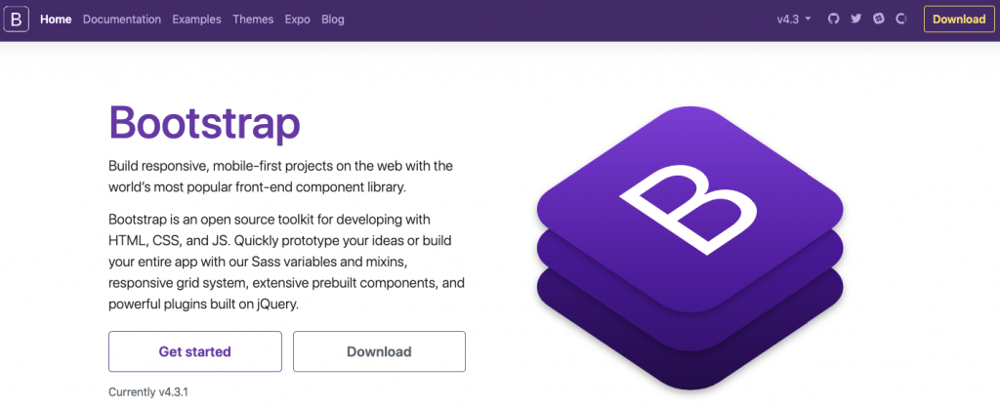

## What are UI Frameworks and how do they work?

UI Frameworks are a set of tools that are convenient for experienced developers and a great resources for web developers that have limited knowledge. For example, Bootstrap which is the most used UI framework, allow developers to use pre-built functions so that they don't have to start from scratch. Similar to how header files work in other programming languages, bootstrap is essentially a super library that has a combination of html, css, and js coupled together with framework foundations. 

## Should you use UI Frameworks over raw HTML and CSS?

UI Frameworks are a great tool for developers, but I don't think people should use them when just starting out. The reason being that if you don't have fundamental knowledge of html and css, it will probably be extremely difficult to understand. A good way to think about UI Frameworks is like a backup camera on a car. Sure it does make things easier, and if you know how to drive you will find it extremely convenient. But you probably shouldn't be using it while you're learning to drive, or rather relying on it while learning to drive. 

## When is it best to use Bootstrap over raw HTML and CSS?

After all thats been said about UI Frameworks you would think that it would be applicable for every situation in the context of web development, but there are still situation in where you should consider using raw HTML and CSS. Because of how popular UI Frameworks such as Bootstrap are, websites that are developed using such tools tend to look very similar. Using pure HTML and CSS can lead to more creative designs, but readability and scalability can be an issue. So in general if you are in a pinch, or working collaboratively with other developers you should definetely consider implementing UI Frameworks through your development process.

## Final thoughts on UI Frameworks

UI Frameworks are a great tool for experienced developers to use, but new developers should be warned that implemenetation of such frameworks can be difficult as there is a learning curve to understanding how they work, especially if you don't particularly enjoy front-end development. If you use UI Frameworks with the intention of learning how they actually work you will have a great time, but just trying to plug and play with them can lead to frustration and diminishing returns. 
