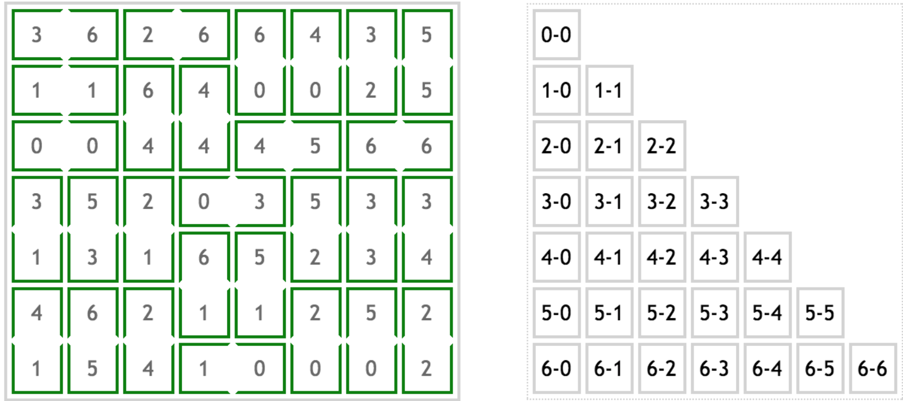

Given a domino class provided by Catie Baker, the goal is to develop a class called DominoSort that utilizes recursive backtracking to arrange unordered pairs into orthogonally adjacent numbers on a grid such that each number of the grid is apart of exactly one domino. 

I worked on implementing a driver class that would read in a text file containing the numbers to test (test.txt), and the DominoSort class which would create a grid place the textfile values in the grid, and utilize recursive backtracking to create a solution. 

This project taught me how to approach algorithm implementation and gave me a better understanding of recursive backtracking. Recursive backtracking can seem pretty intuitive, but actual utilization proved to be difficult and was a big roadblock for me to get over. 

Source: [DominoSearch](https://github.com/bkimcode/bkimcode.github.io/tree/main/projects/%20DominoSearch)
