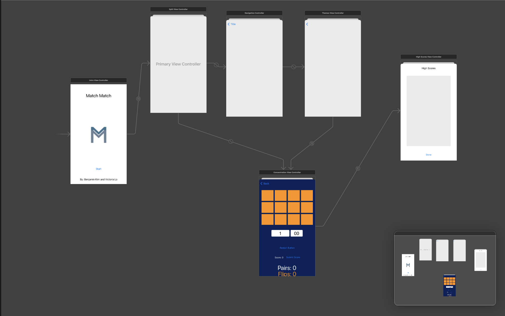

A competitive card matching game developed in swift using the xcode environment, where users are scored based on the amount of time spent on matching a set of cards. Users can pick between 3 different themes, and a hi-scores table keeps track of their current best scores.  

My role for this project was back-end development which included implementing/linking functionality for the mainstoryboard objects my partner created, and implementing my partners requested features. This involved creation of all viewcontrollers which control the functionality of all the buttons and labels along with logic of the connections with the separate screens. 

This project was my first experience with pure back-end development as my partner was focused on the look and design of the app and its features. A lot of compromises had to be made because at times we had different visions of how the app would/should function.  This project taught me a lot about the different things you need to consider with back-end development because often times it is things you're not thinking of if you are a user that's using an app. For example, holding strong references of previous viewcontrollers just in case the user wants to pause the game, they can go back to the main screen (which would pause the timer/progress of their game) and when the user would select the theme again, it would return the game state to what it was when they paused.

Source: [MatchMatch](https://github.com/bkimcode/bkimcode.github.io/blob/b89f65fd776766074375a1856017715a4f4fcd5d/projects/MatchMatch-project.zip)
