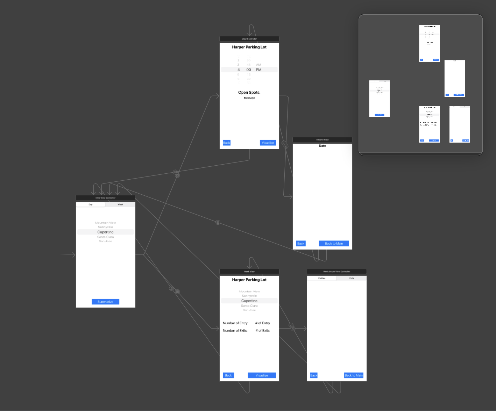

Finding parking on campus can be extremely inconvenient and frustrating, especially when there are no ways to know whether or not a particular lot is full. This can lead to students spending unnecessary time searching through lots that may already be full which can lead to students arriving late to class. 
Through the Park-EZ app, students will be able to easily identify whether certain lots are full and even get recommendations for areas to park by taking into consideration their destination. This will be done by transmitting data from sensors placed on each parking stall in student lots that detect if a car is parked in a spot, and for how long.

My role for this project was creating the framework and data for the app. This involved creating/interpreting the parking data, development of 3/5 view controllers, and the implementations of segues used to connect all screens/viewcontrollers together. The specific viewcontrollers I worked on were the intro, main, and week viewcontrollers. The intro viewcontroller prompted users to choose what setting they would like to view(week view/day view)
and the parameters of the choice they would like to access. Based on the choices the user made, the intro viewcontroller would then segue into either the week or main viewcontroller. The week and main(day) view controller have similar configurations with the main differences being that the week view lets the user view the total number of entries/exits at a parking location per day of the week, while the main view lets users the number of open spots at a given time for the given day (including current day). The main and week viewcontrollers are connected to WeekGraphViewController and SecondView which showed visualizations of the interpreted data.

Working on this project gave me a good sense of how much time/resources are needed to make great apps. I was too ambitious with my initial idea and was unable to implement multiple features that I had planned on implementing. I learned valuable collaboration skills as this was the first project where I was synchronously working with another individual on the same project, but on different parts. This forced me to find effective ways to communicate what I was trying to develop, and find ways to connect my partners development with my own.

Source: [ParkEz](https://github.com/bkimcode/bkimcode.github.io/blob/main/projects/ParkEZ.zip)
