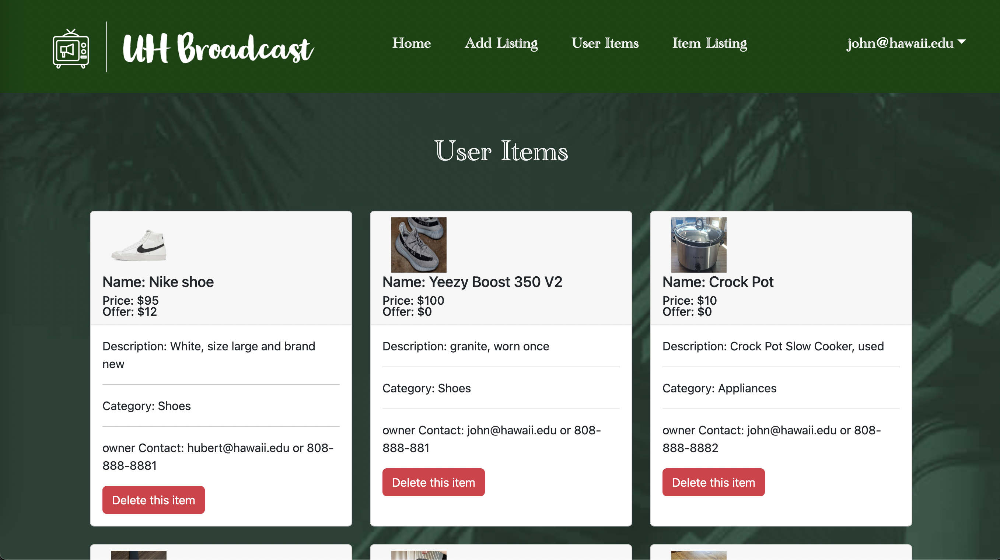

Students are almost always forced to fully communicate externally depending on the requests or issues that they have. In a sense, this either restricts students to their known organizations or extends students to mass external websites that may pose security or physical threats.
By implementing an app permitting only individuals within the UH System, it ensures better familiarity, security, and openness in advertisement. Doing so would result in a more comfortable and approachable environment without the fears of security or authenticity that external websites may include, nor the limited networking that may be included if advertising was done solo.

My role for this project changed throughout the duration of the project as working with agile specifically Issue Driven Project Management. On our first sprint I worked on implementing the landing page minimal functionality for other pages (linking to and from landing page). On our second sprint I worked on implementing a make offer function and testing via continuous integration. For our final sprint I worked on populating data for our users, improved upon the functionality of make offer, and updated test cases to match the changes made for continuous integration.  

This was my first project working with agile project management, meteor and git/ci with more than 1 other user. It was difficult at first because of how overwhelming the sprints seemed, but after getting into it, IDPM actually made things much easier as the constant updates to issues made keeping up to date with progress/status trivial as there were no gaps in communication. 

Source: [UH-Broadcast](https://uh-broadcast.github.io/)
